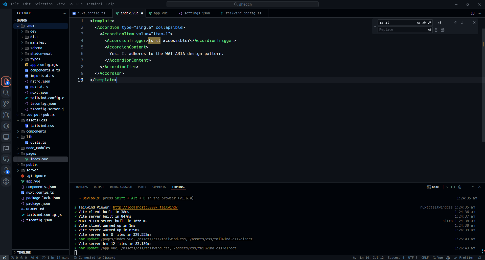

# vsc-presets
A collection of Visual Studio Code customizations compiled from various YouTubers.

## Introduction
**vsc-presets** includes a variety of customizations for Visual Studio Code that I’ve compiled from YouTubers. These presets help enhance the editor’s look and feel. Below, you’ll find the necessary steps to install and apply these presets.

## Installation

Before applying any preset, you need to install the **Custom CSS and JS Loader** extension.

### Steps:
1. **Install the Custom CSS and JS Loader** extension from the VS Code marketplace.
   
2. **Choose a preset** and install its plugins and fonts.

3. **Update `settings.json`**:
   - Press `CTRL + SHIFT + P`, type **"Open User Settings (JSON)"**, and replace the contents with the preset's settings.

4. **Reload CSS and JS**:
   - Press `CTRL + SHIFT + P`, search for **"Reload custom CSS and JS"**, and select it.
   - Restart Visual Studio Code.

Your preset is now applied!

### Note
- All of the CSS and JS content retrieving from original repository which means any update from owner will apply to you automatically. Keep updated!
- I've added some tweaks to settings.json such as smooth scroll, layout changes. It is not **EXACTLY** same as original.

## Preset List

### 1. **nursandiid's Preset**
- **Files**: [View](nursandiid)
- **YouTube Video**: [Watch Here](https://www.youtube.com/watch?v=DHUoWYf3m9I)
- **Repository**: [See](https://github.com/nursandiid/vscode-customizations)
- **Required Plugins**: 
  - Github Theme (Dark)
  - Fluent Icons
  - Jetbrains Icon Theme

#### How it looks:

---

Feel free to browse through the other presets in this repository and follow the same installation steps to apply them to your VS Code environment!

Disclaimer: all the preset credit goes to original owners.
